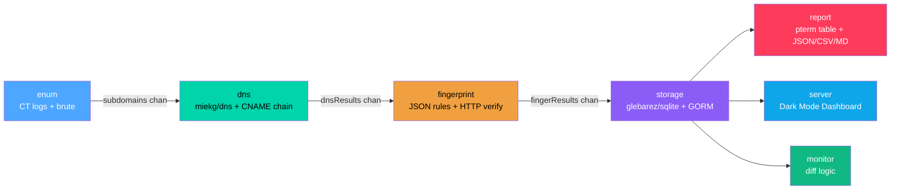

# SubTakeover — Subdomain Takeover Vulnerability Scanner

> **Legal Disclaimer:** This tool is for authorized security testing and educational purposes only. Do not scan domains you do not own or have explicit permission to test. Unauthorized scanning may violate computer fraud and abuse laws. The authors assume no liability for misuse or damage caused by this tool.

A pragmatic, single-binary Go application that detects subdomain takeover vulnerabilities, stores historical scan data in a local SQLite database, reports changes over time, and provides a lightweight web dashboard for visual monitoring.

---

## Pipeline Architecture



## Quick Start

### Build

```bash
git clone https://github.com/liemreny/subtakeover.git
cd subtakeover
go build -o subtakeover ./cmd/subtakeover
```

### Scan a Domain

```bash
# Basic scan using certificate transparency logs
./subtakeover scan -d example.com

# Scan with brute-force wordlist and export to Markdown PoC report
./subtakeover scan -d example.com --source certspotter,brute --wordlist wordlists/common.txt --output md -o report.md

# Scan multiple domains
./subtakeover scan -d example.com -d acme.org --output json -o results.json
```

### Monitor for Changes

```bash
# Compare latest scan with previous scan
./subtakeover monitor -d example.com

# Compare with the 2nd most recent scan
./subtakeover monitor -d example.com --last 2
```

### Launch Dashboard

```bash
# Start dark mode cybersecurity dashboard on port 8080
./subtakeover serve

# Custom port
./subtakeover serve --port 9090
```

### Query History

```bash
# List recent scans
./subtakeover history

# Show findings for a specific scan
./subtakeover history --scan-id 42

# Export findings as JSON
./subtakeover history --scan-id 42 --format json
```

## Commands

| Command | Description |
|---------|-------------|
| `scan` | Enumerate subdomains, resolve DNS, fingerprint services, detect takeover risks |
| `monitor` | Compare latest scans and show a color-coded diff of changes |
| `serve` | Start the dark mode web dashboard with real-time monitoring |
| `history` | Query past scan results from the local SQLite database |

## Project Structure

```
subtakeover/
├── cmd/
│   └── subtakeover/
│       └── main.go              # Cobra CLI entry point (4 subcommands)
├── internal/
│   ├── config/                  # Shared types (DomainResult, ScanConfig) and rate-limit constants
│   ├── enum/                    # Subdomain enumeration (crt.sh API + DNS brute-force)
│   ├── dns/                     # DNS resolution (CNAME chain tracking, wildcard detection)
│   ├── fingerprint/             # Fingerprint engine (JSON rule matching + HTTP verification)
│   ├── storage/                 # SQLite persistence (glebarez/sqlite + GORM, WAL mode)
│   ├── pipeline/                # Scan pipeline orchestrator (enum → dns → fingerprint → storage)
│   ├── report/                  # Terminal output (pterm tables) + JSON/CSV/Markdown export
│   ├── monitor/                 # Scan diff logic (new/fixed/changed vulnerability detection)
│   └── server/                  # HTTP dashboard server (SPA fallback + /api/* endpoints)
├── web/
│   ├── embed.go                 # go:embed filesystem for template embedding
│   └── templates/
│       └── index.html           # Dark Mode cybersecurity dashboard (vis-network topology)
├── wordlists/
│   └── common.txt               # Built-in subdomain wordlist (29 common names)
├── go.mod
├── go.sum
├── Makefile
└── README.md
```

### `internal/` convention

All application logic lives under `internal/` to prevent external import. Each package has a single responsibility:

- **Input packages** (`enum`, `dns`, `fingerprint`) — collect and analyze data
- **Persistence package** (`storage`) — SQLite operations with GORM
- **Orchestration package** (`pipeline`) — wires the full scan workflow via buffered channels
- **Output packages** (`report`, `server`, `monitor`) — render results in different formats

### `cmd/` convention

Single binary entry point using `spf13/cobra`. Each subcommand (`scan`, `monitor`, `serve`, `history`) is a separate cobra command with its own flags.


## Fingerprint Rules

The tool detects 8 cloud service types through JSON fingerprint rules (`internal/fingerprint/rules.json`):

| Service | Pattern | Risk |
|---------|---------|------|
| AWS S3 | `*.s3.amazonaws.com` | High |
| GitHub Pages | `*.github.io` | High |
| Azure CDN | `*.azureedge.net` | Medium |
| Heroku | `*.herokuapp.com` | High |
| Netlify | `*.netlify.app` | High |
| Shopify | `*.myshopify.com` | High |
| Fastly | `*.fastly.net` | Medium |
| CloudFront | `*.cloudfront.net` | High |

Add new services by editing the JSON file — no code changes required.

## Cross-Compilation

```bash
# Build for all platforms
make build-all

# Or manually:
GOOS=linux   GOARCH=amd64 go build -o subtakeover-linux-amd64   ./cmd/subtakeover
GOOS=darwin  GOARCH=arm64 go build -o subtakeover-darwin-arm64  ./cmd/subtakeover
GOOS=windows GOARCH=amd64 go build -o subtakeover-windows-amd64.exe ./cmd/subtakeover
```

## License

MIT
